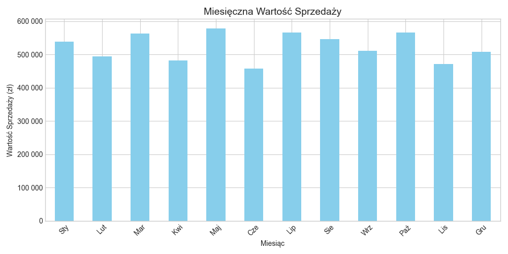
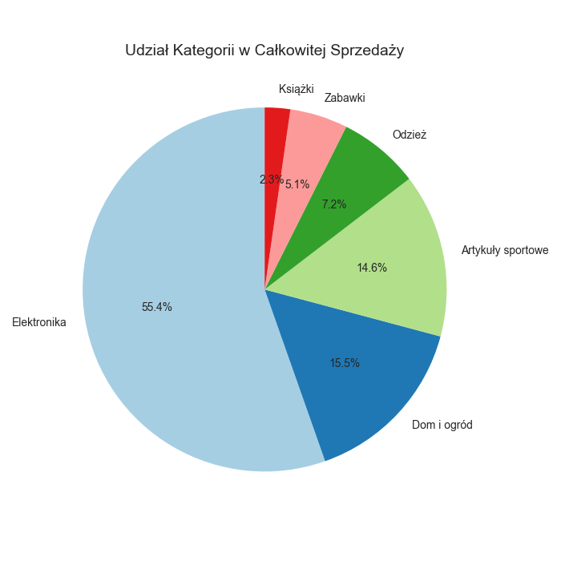
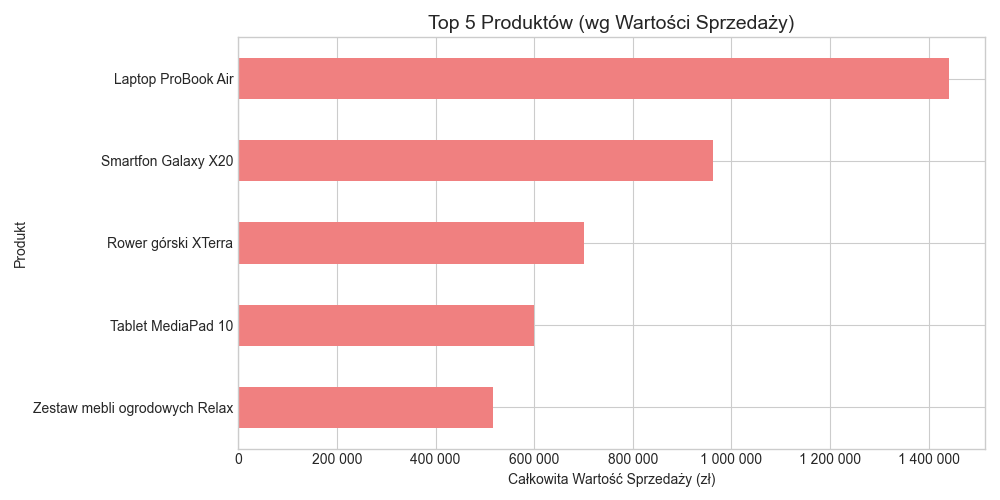

# Część 4: Podsumowanie Wizualizacji i Dashboardu

Wygenerowano dane i wizualizacje kluczowych aspektów sprzedaży. Te elementy mogą posłużyć do budowy interaktywnego dashboardu w Excelu.

## Wygenerowane Wykresy

1.  **Sprzedaż Miesięczna:** Pokazuje rozkład sprzedaży w poszczególnych miesiącach.
    

2.  **Udział Kategorii:** Przedstawia procentowy udział każdej kategorii w całkowitej wartości sprzedaży.
    

3.  **Top 5 Produktów:** Wskazuje produkty generujące najwyższą wartość sprzedaży.
    

*(Pliki PNG zostały zapisane w katalogu `output`)*

## Kluczowe Wskaźniki (KPIs) dla Dashboardu

-   **Całkowita sprzedaż:** 6,278,856.34 zł
-   **Liczba transakcji:** 7,500
-   **Średnia wartość zamówienia:** 837.18 zł
-   **Dynamika H2 vs H1 (symulacja YoY):** 1.80 %

## Elementy Interaktywne (Do zaimplementowania w Excelu)

-   **Fragmentatory (Slicers):** Umożliwiające filtrowanie danych na wykresach i wskaźnikach KPI według:
    -   Kategorii produktów
    -   Regionów
    -   Kwartałów/Miesięcy
-   **Dodatkowe Wykresy:** Można dodać wykres sezonowości (mapa cieplna) lub inne analizy wg potrzeb.
